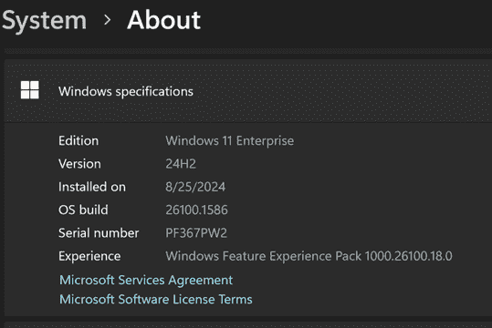

# Windows - Hyper-V
Hyper-V has support for running with OpenHCL when running on Windows. This is the closest configuration to what we ship in Azure VMs, the only difference being that we use Azure Host OS (as opposed to Windows Client or Windows Server).

## Get the right Windows version on your machine

You need to use a Windows version that has development support for OpenHCL. Note that Windows Client and Server versions only have development support for OpenHCL VMs, not production support.

For now, you can use the Windows 11 2024 Update (AKA version 24H2), the third and upcoming major update to Windows 11, as this is the first Windows version to have development support for OpenHCL VMs.

Since this is not yet generally available, you can get it via [Windows Insider](https://www.microsoft.com/en-us/windowsinsider). The Windows Insider Program is a community of millions of Windows users who get to preview Windows features and engage directly with Microsoft engineers to help shape the future of Windows.

Since this is not yet generally available, you can get it via Windows Insider. The Windows Insider Program is a community of millions of Windows users who get to preview Windows features and engage directly with Microsoft engineers to help shape the future of Windows.

Simply [register](https://www.microsoft.com/en-us/windowsinsider/register) with your Microsoft account, which is the same account you use for other Microsoft services, like email, or Microsoft Office and follow these [instructions](https://www.microsoft.com/en-us/windowsinsider/for-business-getting-started#flight). You should choose the “Release Preview Channel” unless you want to experiment a bit more and are willing to forgo stability. 

You may have to click the Check for updates button to download the latest Insider Preview build twice, and this update may take over an hour. Finally go to Settings > About to check you are on Windows 11, version 24H2 (Build 26100.1586). 


Next, make sure Hyper-V is [enabled](https://learn.microsoft.com/en-us/virtualization/hyper-v-on-windows/quick-start/enable-hyper-v).

## Create a VM

Make sure your OpenHCL .bin is located somewhere that vmwp.exe in your Windows host has permissions to read it (that can be in windows\system32, or another directory with wide read access). Then, save the path of the OpenHCL .bin in a var named $Path and save the VM name you want to use in a var named $VmName.

For example:

```powershell
`$Path = ‘C:\Windows\System32\openhcl-x64.bin`
`$VmName = 'myFirstVM`
```

## Create a VM
### Create VM as a Trusted Launch VM
Enables [Trusted Launch](https://learn.microsoft.com/en-us/azure/virtual-machines/trusted-launch) for the VM.
You can use this script with no additional instructions required (simplest path).
```powershell
<your openvmm repo root>\openhcl\New-OpenHCL-HyperV-VM.ps1 -VmName $VmName -Path $Path
```
### Create VM as a VBS VM
Enables VBS for the VM. Coming soon!
### Create VM as a TDX VM
Enables TDX for the VM. Coming soon!
### Create VM as an SNP VM
Enables SEV-SNP for the VM. Coming soon!

### Set up guest OS VHD
Running a VM will be more useful if you have a guest OS image. Given that OpenHCL is a compatibility layer, the goal is to support the same set of guest OS images that Hyper-V currently supports without a paravisor.

You can pick any existing image that you have or download one from the web, such as from Ubuntu, or any other distro that is currently supported in Hyper-V.

```powershell
`Add-VMHardDiskDrive -VMName $VmName -Path "<guest OS VHDX path>"-ControllerType SCSI -ControllerNumber 0 -ControllerLocation 1`
```
